

  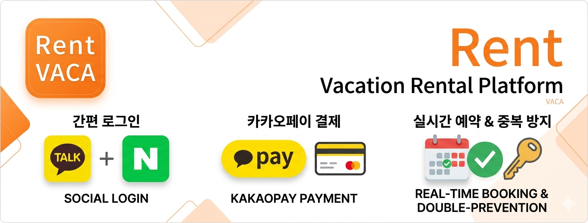
  <h3비대면 과제관리 시스템</h3>

## ⌨️ 기간

- **2025.08.25 ~ 2025.09.30(5주)**

 

## 🔎 목차

1. <a href="#subject">🎯 주제</a>
1. <a href="#mainContents">⭐️ 주요 기능</a>
1. <a href="#systemArchitecture">⚙ 시스템 아키텍쳐</a>
1. <a href="#skills">🛠️ 기술 스택</a>
1. <a href="#erd">💾 ERD</a>
1. <a href="#contents">🖥️ 화면 소개</a>
1. <a href="#developers">👥 팀원 소개</a>

 

<!------- 주제 시작 -------->

## 🎯 주제

**OAuth 2.0,** **REST API** 기반 간편 로그인 및 결제 숙소 예약 플랫폼 
 
**OAuth 2.0** 카카오/네이버 소셜 로그인 연동 
**REST API** 통신, 결제 승인/취소 로직
 
 

 

**주요 기능**

- OAuth 2.0 표준 인증 절차를 준수하여 사용자 편의성을 높였으며, 발급받은 Access Token을 통해 안전하게 사용자 정보를 획득했습니다.
- 카카오페이의 단건 결제 API를 활용하여 결제 준비(Ready), 승인(Approve) 프로세스를 설계하였습니다.
  

<a href="#tableContents">목차로 이동</a>

## ⭐️ 주요 기능

### 공통

- 인터셉터를 통해 해당 페이지의 기능을 회원 등급에 맞게 제한합니다.

---

### 개인 회원

- 회원가입을 카카오톡, 네이버 소셜 로그인 또는 이메일로 회원가입이 가능합니다.
- 다양한 키워드에 맞는 숙소를 검색 가능합니다.
- 숙소 예약 시 다른 유저와 중복 예약을 방지하도록 설계하였습니다.
- 이용한 숙소에 대해 별점과 리뷰를 작성할 수 있습니다.
- 사용자가 원하는 숙소를 찜목록에 추가할 수 있습니다.
- 예약한 숙소정보를 확인할 수 있습니다.
- 관리자 또는 숙소에 문의를 남길 수 있습니다.

---

### 기업 회원

- 기업 회원은 회원가입 시 이메을 회원가입을 통해서만 가입이 가능합니다.
- 숙소 관리를 통해 숙소 정보 등록, 수정, 삭제할 수 있습니다.
- 숙소를 등록했다면 객실 관리를 통해 숙소에 있는 객실을 등록, 수정, 삭제할 수 있습니다.
- 예약자 관리를 통해 해당 날짜에 예약자 정보를 확인 및 취소 요청 시 취소할 수 있습니다.
- 계정설정을 통해 사업자 정보와 비밀번호를 수정할 수 있습니다.

---

### 관리자

- 회원 관리를 통해 회원의 사용을 제한 및 차단할 수 있습니다.
- 문의 내역 관리를 통해 회원들이 문의한 내용을 답변할 수 있습니다.
- 관리자만 공지사항을 작성할 수 있습니다.

---

<a href="#tableContents">목차로 이동</a>

 

<!------- 시스템 아키텍쳐 시작 -------->

## ⚙ 시스템 아키텍쳐

- Frontend: HTML5, CSS3, JavaScript를 활용하여 깔끔하고 가독성 좋은 UI를 구축 
- Backend & DB: Spring 프레임워크를 사용하여 서버를 구현하였으며, MySQL을 통해 사용자, 숙소 정보 등 데이터를 관리

본 프로젝트는 Spring MVC 아키텍처를 기반으로 설계된 숙소 예약 플랫폼입니다. 
Naver 및 Kakao OAuth 2.0을 연동하여 로그인 편의성을 높였고, Kakao Pay API를 통해 실전적인 결제 프로세스를 구현했습니다. 
또한, Spring Interceptor를 활용하여 사용자 인증 및 권한을 효율적으로 제어하도록 설계했습니다.

<a href="#tableContents">목차로 이동</a>

 

<!------- 기술 스택 시작 -------->

## 🛠️ 기술 스택

### 💻 FrontEnd

---

### ⚙️ BackEnd

---

### 🤝 Collaboration

---

<a href="#tableContents">목차로 이동</a>

 

<!------- ERD 시작 -------->

## 💾 ERD

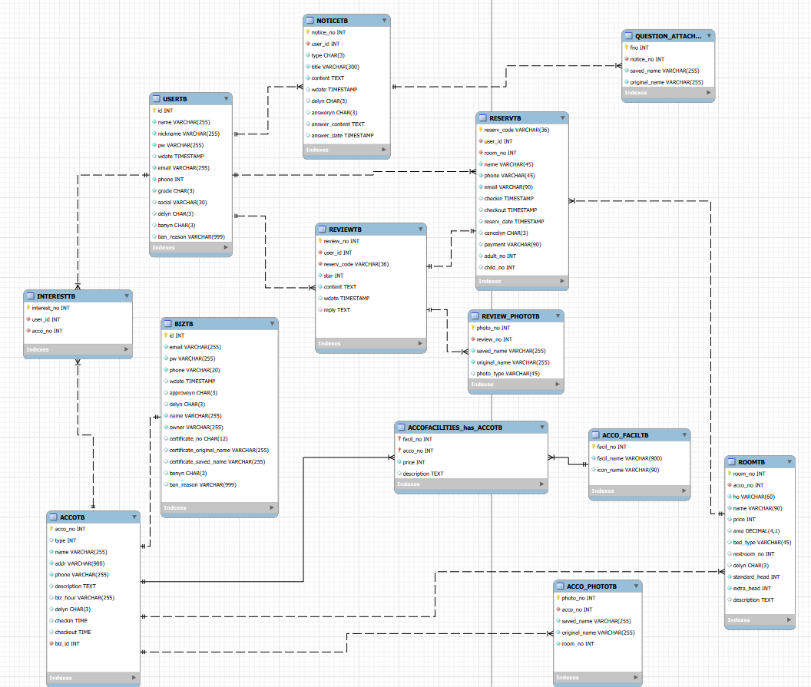

<a href="#tableContents">목차로 이동</a>

 

<!------- 화면 소개 시작 -------->

 

## 🖥️ 화면 소개

### 1. 공통

<table>
    <tr>
        <td align="center" width="200">
            <h5>메인 페이지</h5>
            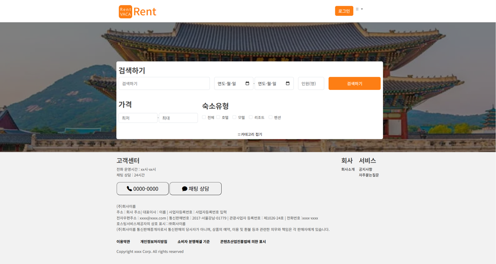  
        </td>
        <td align="center" width="200">
            <h5>숙소 검색</h5>
            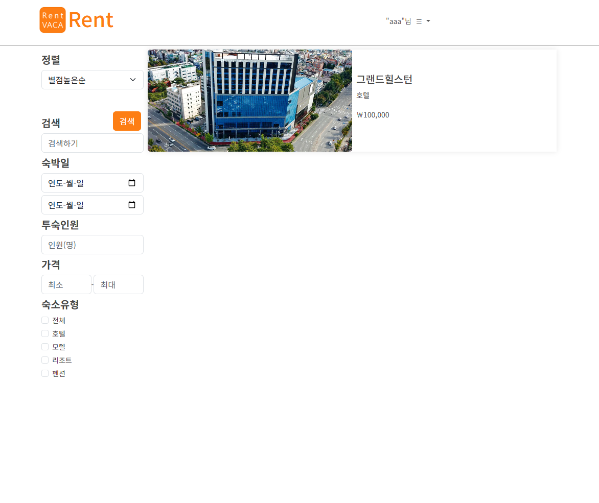
        </td>
        <td align="center" width="200">
            <h5>숙소 정보</h5>
              
        </td> 
        <td align="center" width="200">
            <h5>이메일 찾기</h5>
            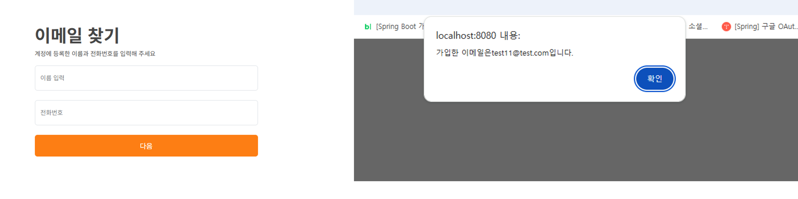
        </td>
        <td align="center" width="200">
            <h5>비밀번호 찾기</h5>
            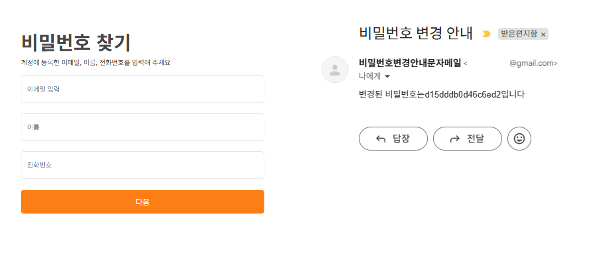
        </td>
    </tr>
    <tr>
      <td align="center">
        
✔ 메인 페이지로 중앙 카테고리 펼치기를 통해 상세 검색이 가능합니다.

      </td>
      <td align="center">
        
✔ 숙소 검색 시 검색된 숙소를 표시해줍니다.

        
✔ 좌측 상세 키워드 검색으로 더 상세하게 숙소를 검색할 수 있습니다.

      </td>
      <td align="center">
        
✔ 숙소의 상세 정보 페이지입니다.

        
✔ 결제하기 클릭 시 선택한 방의 결제창으로 이동합니다.

      </td>
      <td align="center">
        
✔ 가입한 정보 입력 후 정보가 맞다면 이메일을 보여줍니다.

      </td>
      <td align="center">
        
✔ 가입한 정보 입력 후 정보가 맞다면 가입한 이메일로 임시비밀번호를 발송합니다.

      </td>
    </tr>
</table>

### 2. 일반 회원

<table>
    <tr>
        <td align="center" width="200">
            <h5>회원가입</h5>
            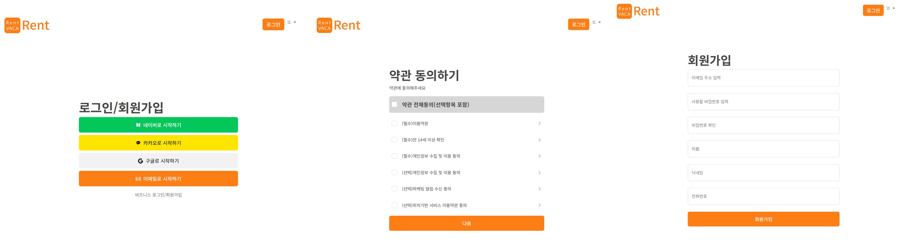  
        </td>
        <td align="center" width="200">
            <h5>로그인</h5>
            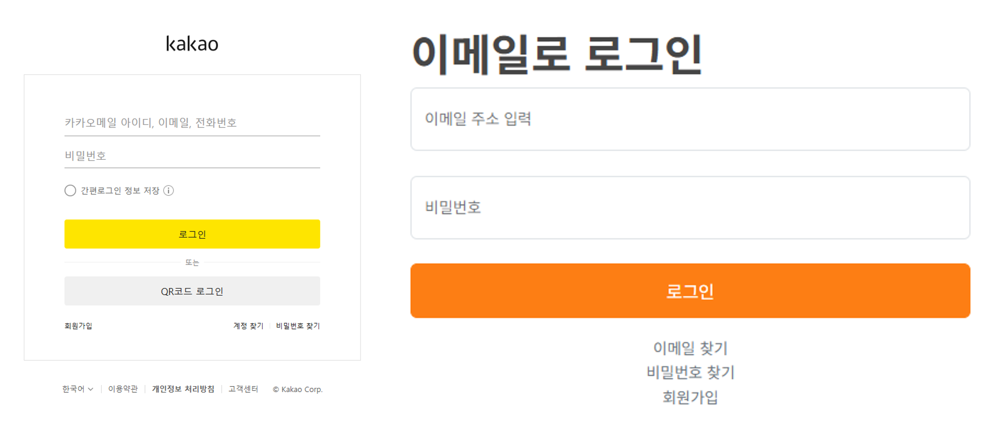  
        </td>
        <td align="center" width="200">
            <h5>개인 정보 수정</h5>
            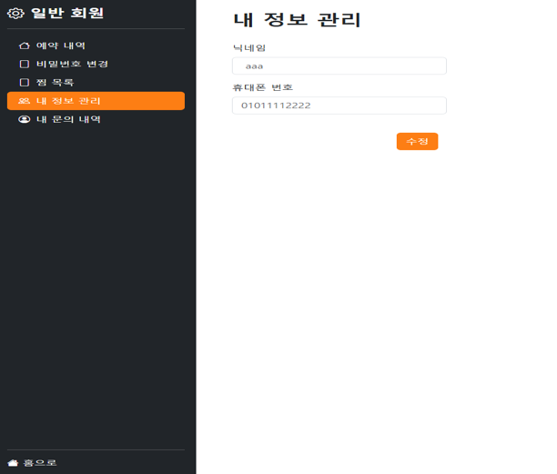  
        </td>
        <td align="center" width="200">
            <h5>문의 내역</h5>
            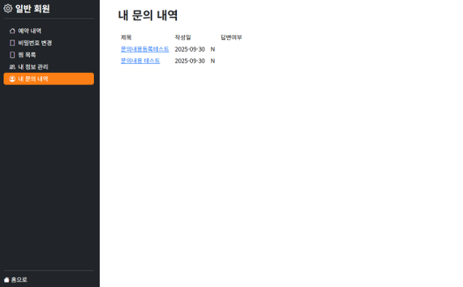  
        </td>
        <td align="center" width="200">
            <h5>예약 내역</h5>
            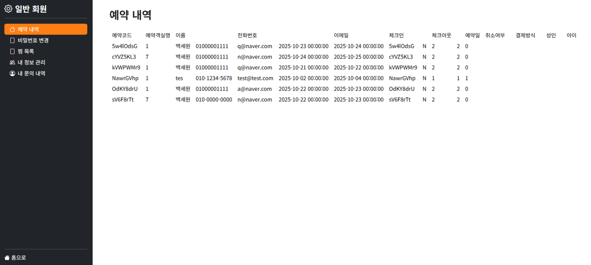  
        </td>
    </tr>
    <tr>
      <td align="center">
        
✔ 약관동의 체크 사항은 DB에 저장됩니다.

      </td>
      <td align="center">
        
✔ 회원가입한 정보 또는 소셜 로그인으로 로그인합니다.

      </td>
      <td align="center">
        
✔ 닉네임, 휴대폰 번호, 비밀번호를 수정할 수 있습니다.

      </td>
      <td align="center">
        
✔ 내가 문의한 문의 내역 목록을 보여줍니다.

        
✔ 문의 내역 제목을 클릭하여 답변 내역을 확인 가능합니다.

      </td>
      <td align="center">
        
✔ 예약 내역의 상세정보를 보여줍니다.

        
✔ 예약한 숙소를 취소할 수 있습니다.

      </td>

    </tr>
</table>
<table>
    <tr>
        <td align="center" width="1000">
            <h5>숙소 결제</h5>
            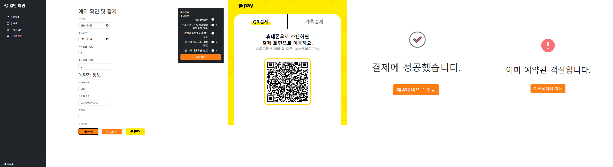  
        </td>
    </tr>
    <tr>
      <td align="center">
        
✔ 숙소 예약 페이지 및 결제 완료 및 실패입니다.

        
✔ 예약자 정보 및 예약날짜 선택 후 결제정보를 선택하여 예약합니다.

        
✔ 계좌이체와 카드결제는 사업자정보가 있어야 해서 결제 완료로 바로 이동합니다.

        
✔ 카카오페이 결제 시 카카오페이 결제 페이지로 이동합니다.

        
✔ 카카오페이 결제도 관리자 키를 이용하여 테스트 결제로 구현하였습니다.

      </td>
    </tr>
</table>

### 3. 기업 회원

<table>
    <tr>
        <td align="center" width="200">
            <h5>회원가입</h5>
            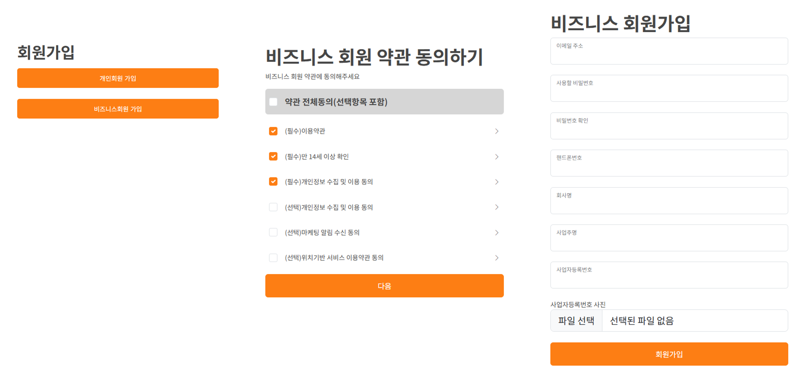  
        </td>
        <td align="center" width="200">
            <h5>개인 정보 수정</h5>
            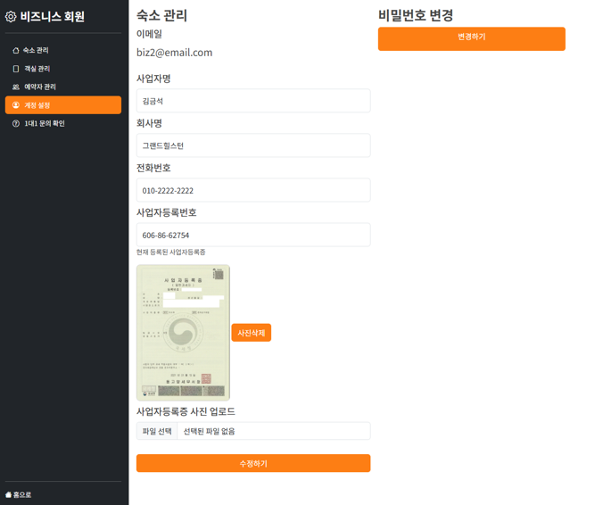  
        </td>
        <td align="center" width="200">
            <h5>비밀번호 수정</h5>
            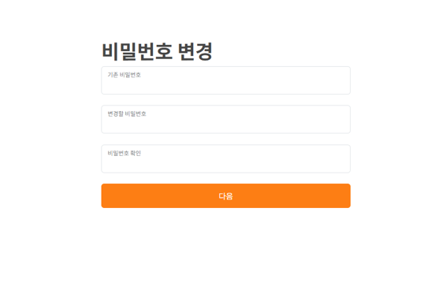  
        </td>
        <td align="center" width="200">
            <h5>숙소 관리</h5>
            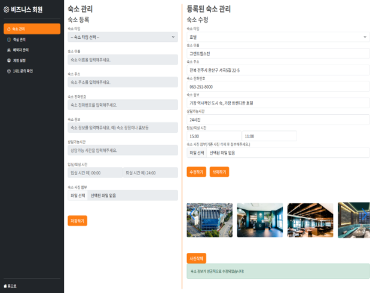  
        </td>
        <td align="center" width="200">
            <h5>객실 관리</h5>
            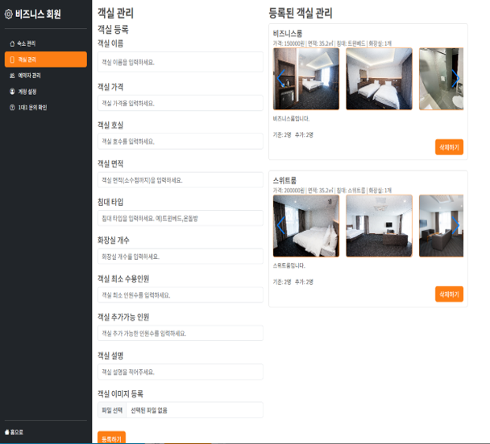  
        </td>
    </tr>
    <tr>
      <td align="center">
        
✔ 기업 회원은 약관 동의를 일반 회원과 다른 테이블로 관리합니다.

      </td>
      <td align="center">
        
✔ 사업자명, 회사명, 전화번호, 사업자등록번호를 수정할 수 있습니다.

      </td>
      <td align="center">
        
✔ 비밀번호 수정 페이지입니다.

      </td>
      <td align="center">
        
✔ 숙소 등록, 수정 페이지입니다.

        
✔ 숙소를 등록해야 수정 가능하도록 프론트엔드, 백엔드에서 구현하였습니다.

      </td>
      <td align="center">
        
✔ 객실 등록, 삭제 페이지입니다.

        
✔ 숙소 등록 시 페이지에 들어올 수 있도록 구현하였습니다.

      </td>
    </tr>
</table>

### 4. 관리자

<table>
    <tr>
        <td align="center" width="200">
            <h5>회원 관리</h5>
            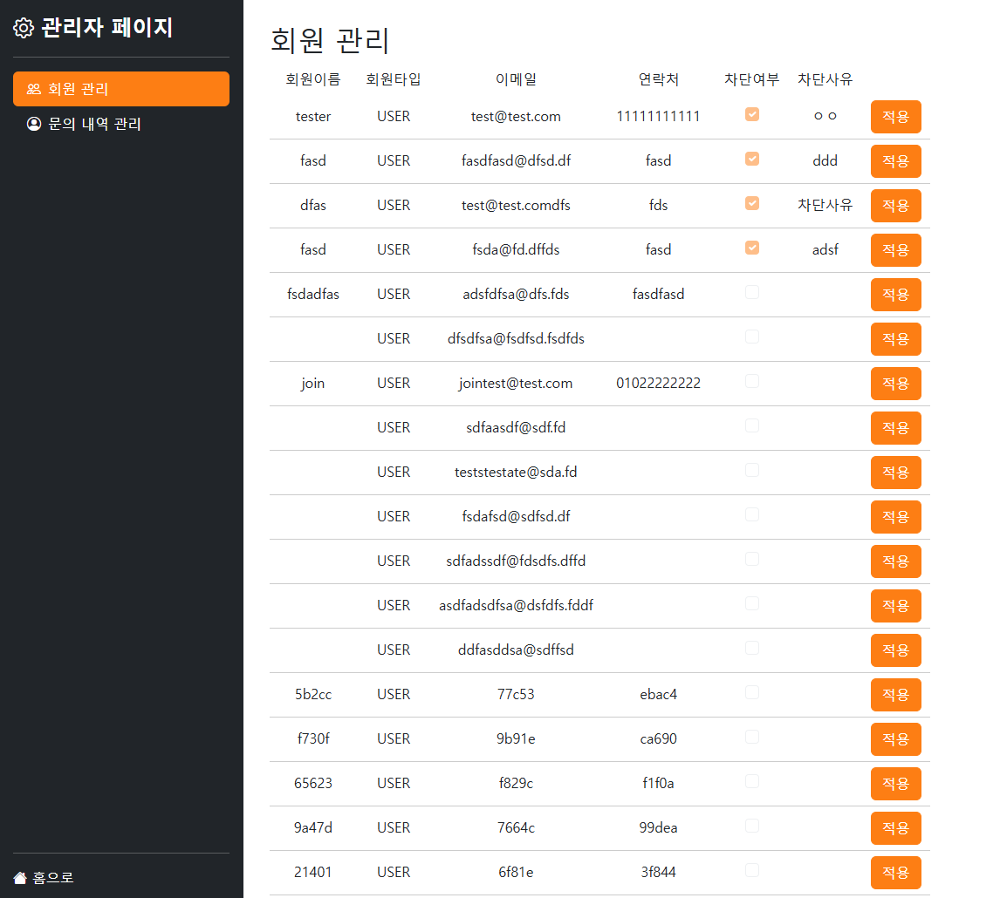  
        </td>
        <td align="center" width="200">
            <h5>문의 내역 관리</h5>
            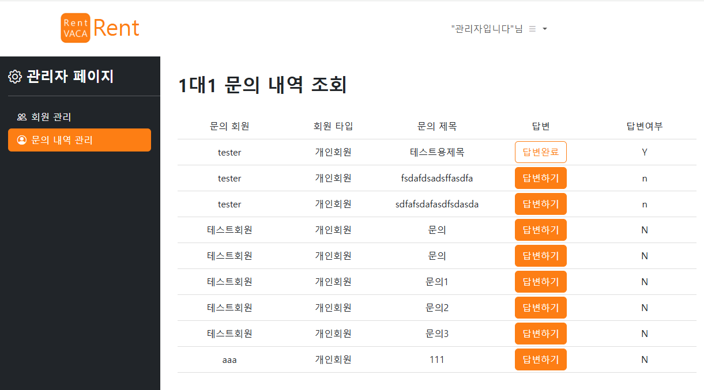  
        </td>
        <td align="center" width="200">
            <h5>공지사항 작성</h5>
            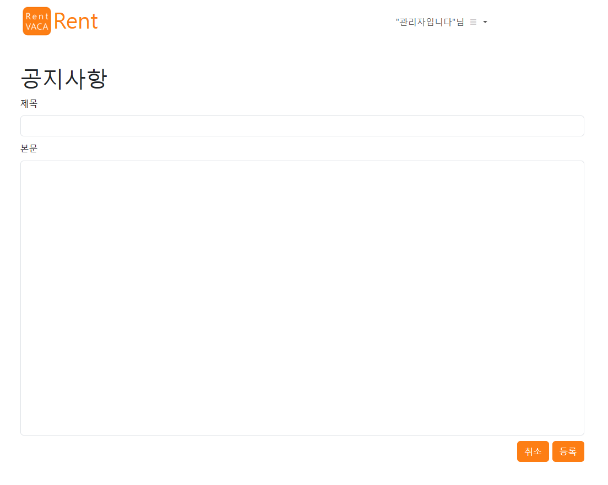  
        </td>
    </tr>
    <tr>
      <td align="center">
        
✔ 일반, 기업 회원을 관리할 수 있는 페이지입니다.

      </td>
      <td align="center">
        
✔ 문의 내역을 확인하고 작성할 수 있습니다.

      </td>
      <td align="center">
        
✔ 공지사항을 작성 페이지입니다.

      </td>
    </tr>
</table>

<a href="#tableContents">목차로 이동</a>

 

### ✔ 프로젝트 결과물

---

<!-- - [포팅메뉴얼] -->
<!-- - [발표자료] -->
- [중간발표자료](./ppt/중간발표_eLMS.pdf)
- [최종발표자료](./ppt/최종발표_eLMS.pdf)

<!------- 팀원 소개 시작 -------->

## 👥 팀원 소개

<table>
    <tr>
        <td align="center" width="200">
            <h5>Name</h5>
        </td>
        <td align="center" width="200">
            <h5>백세원</h5>
        </td>
        <td align="center" width="200">
            <h5>길현우</h5>
        </td>
        <td align="center" width="200">
            <h5>이미소</h5>
        </td>
    </tr>
    <tr>
        <td align="center" width="200">
            <h5>역할</h5>
        </td>
        <td align="center" width="200">
            <h5>풀스택</h5>
        </td>
        <td align="center" width="200">
            <h5>백엔드</h5>
        </td>
        <td align="center" width="200">
            <h5>풀스택</h5>
        </td>
    </tr>
</table>

<a href="#tableContents">목차로 이동</a>

